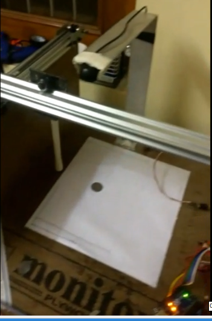

# Image-processing-with-robotic-arm
## About:
* This Robot was built for the segragation of metallic round object, which can be used in industries or for garbage segregation if fix sized and shape object need to be segregated.
## Technical details:
### Software:
*  Through background subtraction and using Inverse Kinematics we can move the robotic arm.
* The code is written in python and import the library pyfirmata for communicating with the arduino and then run the example of standard firmata library in arduino.
### Hardware:
* 2 stepper motors was used with easy driver (for better control of stepper motor) and Arduino as micro-controller.
* Camera and Laptop was used to read the camera frames and process it, finally transmitting to Arduino for controlling stepper motor to move the end effector to desired location.

## Device image

## Device working videos
* [demo video](https://drive.google.com/file/d/1eLh3OXNollj0qVDoGT9Q1KkzQ-V80hNA/view?usp=sharing) for single object localization and tracing.

* [demo video](https://drive.google.com/file/d/1hKvEndr-Cx-MMgwWZ3WBfSbs_qFxjQ0z/view?usp=sharing) for multi object localization and tracing.
